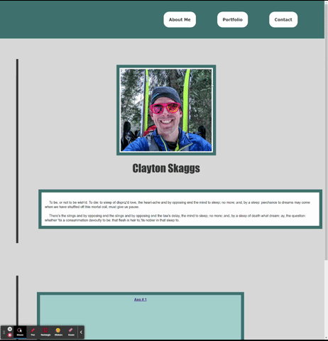

---

 

<h5 align="center">

💼 Module 2 Challenge 💼 
By Clayton Skaggs 
(WW20.2) / May 17th 2022

Version 0.1</h5>

---
 
 

<h3 align="center">User Story</h3>

---

<b>AS</b> AN employer 
<b>I WANT</b> to view a potential employee's deployed portfolio of work samples 
<b>SO THAT</b> I can review samples of their work and assess whether they're a good candidate for an open position

 
 
 

<h3 align="center">Acceptance Criteria</h3>

---

🌟 🌟 <b>GIVEN</b> I need to sample a potential employee's previous work 🌟 🌟  

<b>WHEN</b> I load their portfolio 
✔️ THEN I am presented with the developer's name, a recent photo or avatar, and links to sections about them, their work, and how to contact them  
<b>WHEN</b> I click one of the links in the navigation 
✔️ THEN the UI scrolls to the corresponding section  
<b>WHEN</b> I click on the link to the section about their work 
✔️ THEN the UI scrolls to a section with titled images of the developer's applications  
<b>WHEN</b> I am presented with the developer's first application 
✔️ THEN that application's image should be larger in size than the others  
<b>WHEN</b> I click on the images of the applications 
⌠THEN I am taken to that deployed application  
<b>WHEN</b> I resize the page or view the site on various screens and devices 
⌠THEN I am presented with a responsive layout that adapts to my viewport

 
 
 

<h3 align="center">Mock Layout</h3>

---

 
 

<h3 align="center">Final Product GIF</h3>

---

 
 

<h3 align="center">Deployment Information</h3>

---

 
 

🚀 <a href="https://github.com/DesertCow/Module2-Challenge_Skaggs">github.com/DesertCow/Module2-Challenge_Skaggs</a> 🚀
 
 
🛰️ <a href="https://desertcow.github.io/Module2-Challenge_Skaggs">desertcow.github.io/Module2-Challenge_Skaggs/</a> 🛰️

---

 
 
